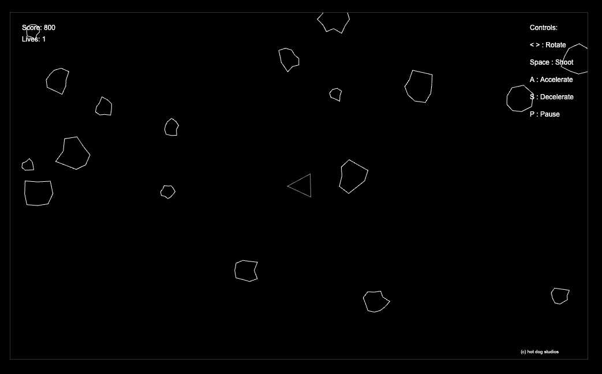

# Asteroids!

A modern take on the classic Asteroids arcade game, built with HTML5 Canvas and JavaScript.

## Features

- Classic Asteroids gameplay with modern controls
- Lives system (3 lives)
- Score tracking
- Pause functionality
- Dynamic asteroid splitting
- Smooth controls and physics
- Responsive design
- Phosphorescent glow effects for all game objects
- Enhanced visual feedback for collisions and thrust
- Optimized movement and rotation controls
- 16:9 widescreen display

## Controls

- `<` `>` : Rotate ship (smooth rotation with momentum)
- `Space` : Shoot
- `A` : Accelerate
- `S` : Decelerate
- `P` : Pause/Unpause

## How to Play

1. Open `index.html` in a modern web browser
2. Use the controls to navigate your ship
3. Shoot asteroids to break them into smaller pieces
4. Avoid collisions with asteroids
5. Try to achieve the highest score possible

## Technical Details

- Built with vanilla JavaScript
- Uses HTML5 Canvas for rendering
- No external dependencies
- Responsive design that works on modern browsers
- 1204x706 canvas resolution
- Smooth animation with delta time
- Advanced collision detection using SAT algorithm

## Development

The game is built using:
- HTML5 Canvas for graphics
- JavaScript for game logic
- CSS for basic styling

## License

(c) moshix for hot dog studios 